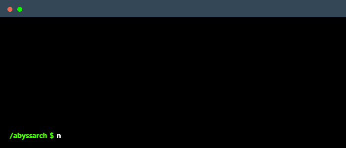

 

    

---

## 🌍 Language / 言語

### [🇬🇧 English](#english-version) | [🇯🇵 日本語](#japanese-version)

---

## English Version

### About me
As a software engineer, I am always drawn to new challenges and opportunities to learn. I am particularly interested in the field of artificial intelligence, and I am curious about the potential of AI to shape our future. I am eager to connect with like-minded individuals to explore and create innovative products.

### Main skills
#### Frameworks

#### Databases

#### Platforms & Languages

#### Tools & others

### Studying

### Connect with me!

    

---

## Japanese Version
(日本語バージョン)

### 自己紹介
私はソフトウェアエンジニアであり、新しい挑戦や学ぶ機会に常に惹かれます。特に人工知能（AI）の分野に興味があり、AIが私たちの未来をどのように形作るかについて好奇心を抱いています。同じ志を持つ方々と繋がり、革新的な製品を探求し、作りたいと思っています。

### 主なスキル
#### フレームワーク

#### データベース

#### プラットフォーム & 言語

#### ツール & その他

### 勉強中

### 私に連絡してください！

    

---

